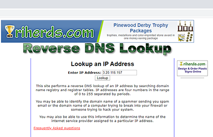
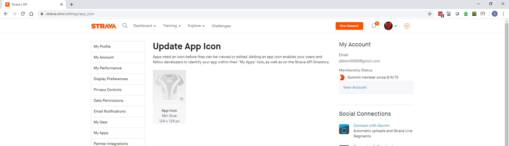
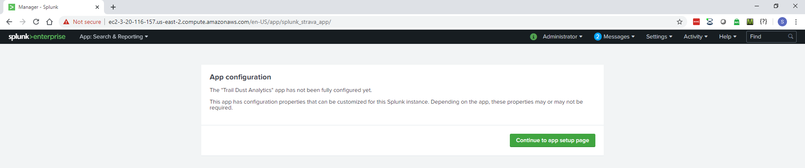

# Documentation - Trail Dust Analytics

Written By Steve Benn 3/31/2020

---
## Table of contents
1. App Description/Features
2. Prerequisites
3. Installation
4. Configuration
5. Troubleshooting

---
## 1. App Description/Features

##### Why Does this App Exist?

Trail Dust Analytics was developed strictly for educational purposes. It does not add any value to Splunk in a production setting. I needed a project as a platform to learn application development components and processes for Splunk. As a cycling enthusiast, I chose Strava as the basis for this project because I find the data they supply to their users interesting and relatable. Strava also happens to have a very nice API to serve up your data.

---

---

#### About Strava

Strava logs data for fitness activities like running and biking. Examples of the metrics they capture include duration of the activity, speed, distance, heartrate, plus many more. For those of you who are not familiar with Strava, [click here](https://www.strava.com/features) for more information.

---

#### What Does This App Do?

Simply put, this app retrieves your activities data from Strava's API using a modular input, and indexes it into Splunk. A series of dashboards in Splunk aggregate and display your activity data in a meaningful way. The idea is for the user to recognize patterns in their training regimens in hopes of becoming a better athlete.

#### How Does This App Work?

##### Authentication Handler

The authentication handler manages authentication between Splunk and Strava's API. Access to the API requires an access token (oauth2 model). The handler acquires a temporary code which is then exchanged for an access token. The credentials supplied by the user and Strava are written to inputs.conf in the app's local directory.

##### Modular Input

The modular input will use the access token and other credentials stored by the authentication handler to access Strava's activities endpoint to retrieve your activities data. All activities data is indexed as JSON in the Strava index.

To prevent duplicate data from being indexed, an epoch timestamp of the latest activity consumed by the input is stored in a checkpoint file. Before the input executes a REST call for activities data, it will check the epoch timestamp. **reword**

##### Refresh Handler

Before attempting to retrieve activities, the modular input will check the expiration date of the access token. If it is expired, the refresh handler will make a REST call to Strava's oauth/token endpoint for a new access token.

##### Dashboards

---

The overview dashboard aggregates data from all of your activities, and compares them to one another.

---

---

Each activity has it's own dashboard for more in-depth analysis.
Although Strava logs data for several dozen different activities, this app focuses on biking, running, and hiking (for now).

---

---

All of the dashboards in Trail Dust Analytics utilize a base-search query to supply the panels with the fields needed for them to run their post-process queries. Post-process queries reduce the load time for dashboards with a large number of panels.

---

##### Querying Strava Activities Data in Splunk

If you wish to view your activities data in its raw state, this app has a search feature for executing ad-hoc search queries. 

**NOTE:** Executing search queries outside of the Trail Dust Analytics App will result in missing data. Requirements for search queries are as follows:

1. All queries begin with **index=strava**
2. Activities data is referenced by the date/time in which the activity occurred, not the date/time they where indexed. Start your search with the time picker set to **All-Time**. Once you know your earliest and latest activity dates, you can refine your searches from there.

---

---

More detailed information on the  technical aspects of this app can be reviewed in the image below.

---

## 2. Prerequisites

1. A [Strava](https://www.strava.com) account. If you are a hiring manager that has interviewed me as a candidate for a Splunk position, you may contact me at **steve.benn@harbingerinfosolutions.com** for a demo account.
2. **At least** 1 months worth of running, biking, or hiking activities data logged to your Strava account. This app will work with less data, but more is recommended to best demonstrate the full features and capabilities of this app.
3. A device to log your activities data to Strava. Most people use a mobile phone with the Strava app installed, or have a GPS device such as a [watch](https://blog.strava.com/five-watches-that-work-with-strava-16406/) integrated with Strava. A demo account with this type of data already pre-populated can be requested by hiring managers.
4. Devices to record heartrate (all activities) and [cadence](https://heavy.com/sports/2017/02/top-best-speed-cadence-sensors-bike-garmin-edge-zwift-computer/) (biking only) to Strava. Although not required, you will need such device(s) if you would like to track these metrics in Trail Dust Analytics. **NOTE:** Most watches integrated with Strava have a built-in heartrate monitor.
5. Windows 10 64-bit or Linux 64-bit Operating system.
6. An instance of Splunk Enterprise **v7.2.0 - v7.3.4**.

* [Download Splunk for Windows 10 (64-bit)](https://www.splunk.com/page/previous_releases#x86_64windows)
* [Download Splunk for 2.6+ kernel Linux distros (64-bit)](https://www.splunk.com/page/previous_releases#x86_64linux)
* Instructions for installing Splunk on [windows.](https://docs.splunk.com/Documentation/Splunk/7.3.4/Installation/InstallonWindows)
* Instructions for installing Splunk on [Linux.](https://docs.splunk.com/Documentation/Splunk/7.3.4/Installation/InstallonLinux)

## 3. Installation

#####  All-in-One Splunk Deployment

1. [Download](https://github.com/Weavo/TDA_for_Splunk/blob/master/TDA_for_Splunk.tar.gz) Trail Dust Analytics. 
**NOTE:** The file downloads with a .tar.gz extension. Do not attempt to run this file.
2. [Click here](https://docs.splunk.com/Documentation/AddOns/released/Overview/Singleserverinstall) for instructions on installing this app using Spunk Web. Disregard step one of Splunk's instructions  as you have already downloaded the app.
3. Restart Splunk to complete the app installation.

##### Distributed Deployment

Do not install this app in a distributed environment. Functionality in distributed deployments will be available in future versions.  

## 4. Configuration

Follow the instructions below on how to obtain your Strava API access credentials and configure Splunk to interact with Strava's API.

### Strava

[Click here](https://www.strava.com/settings/api) to submit an API application to Strava. Fill out the application with the information provided below:

---

1. **Application Name:** Trail Dust Analytics
2. **Category:** Performance Analysis
3. **Club:** leave blank
4. **Website:** https://github.com/Weavo/TDA_for_Splunk
5. **Application Description:** Import your Strava data into Splunk and review it with a series of dashboards.
6. **Authorization Callback Domain:** The callback domain refers to the domain in which your Splunk host resides. For example, if your domain is exmaple@traildustanalytics.com, the callback domain you need to provide to Strava would be traildustanalytics.com
---
[Click here](https://remote.12dt.com/) to find your domain using a free reverse DNS lookup service provided by remote.12dt.com.
Enter the **public IP** of your Splunk host in the text box and click "Lookup".

---

After submitting the application, Strava will ask you to select a picture to associate with the app. We suggest that you use the Trail Dust Analytics logo located in the docs/images directory of this application.

---

Submission of the application will redirect you to the "My Application" page. Displayed here are the client ID and client secret credentials you will need to access Strava's API.

---

### Trail Dust Analytics

After logging into Splunk and selecting the Trail Dust Analytics App, you will be prompted for the client Id and client secret credentials from the previous step by the setup wizard if this is the first time you have used the app after installation. 

---

After clicking "save" in the previous step, the setup page of the application will load. This page will help you obtain an authorized access token to Strava's API.

**NOTE**: The credentials you provided in the setup wizard are loaded into the textboxes shown below. If one or both of these credentials are mistyped in the setup wizard, you have the opportunity to change them here.

Click "Authorize" to request an access token from Strava.

---

Click "Submit" to redirect your browser to Strava's login page. Log in to Strava if you are not already logged in.

---

When prompted by Strava, click "Authorize" pictured in the screenshot below.

---

After clicking "Authorize" in the previous step, your browser will be redirected back to your Splunk instance. You will need to log back into Splunk Web when this happens.

---

If a Strava access token was obtained, you will see the following:

---

#### Almost There!

Trail Dust Analytics has been fully configured at this point. The only thing left to do is allow time for the modular input to pull your activities data from Strava's API and index it into Splunk.

**NOTE:** It may take up to one second per event for all of your Strava activities data to be indexed. For the demo account, this takes approximately five minutes, please be patient.

## 5. Troubleshooting

In this section I will cover a few common troubleshooting scenarios you may encounter when using this app. If you come across a problem that this section doesn't cover, please submit an issue following these [instructions](https://help.github.com/en/enterprise/2.15/user/articles/creating-an-issue) from Github. Include the following information:

1. Name
2. Version of Splunk you are running the app on
3. OS version
4. A detailed description of the issue you are experiencing
5. Steps to recreate the issue

---

### Example Scenarios

#### -I attempted to request an access token from Strava and encountered an error.-

If you experience a "Bad Request" error after clicking "Submit" on the pop-up box in the setup page, this means that either the client ID and or client secret values you entered in the Setup Wizard are invalid.

1. Double check these values my logging into Strava's website and viewing them in the "My Application" section under Settings.
2. Return to the setup page and re-enter both values in the textboxes.

3. Click "Authorize" to request an access token and you should be successful.

---

#### -One or more dashboards to not display ANY data. What gives?-

This app displays data for outdoor cycling, indoor cycling (virtual ride), running and hiking. If you did not log any data to Strava for one or more of these activities, then the respective dashboard(s) will look soemthing like this:

---

#### -How come the dashboards do not display cadence, calories or heart rate information?-

1. Cadence and heart rate metrics both require an external sensor in order to be recorded by Strava. Please review the Prerequisites section of this document.
2. Strava cannot calculate the calories metric unless you record your heart rate during an activity.

---

#### -When executing a search query for Strava activities data, no results are returned.-

1. Review the "Querying Strava Activities Data in Splunk" sub section under the App Description/Features portion of this document.
